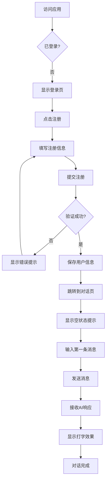
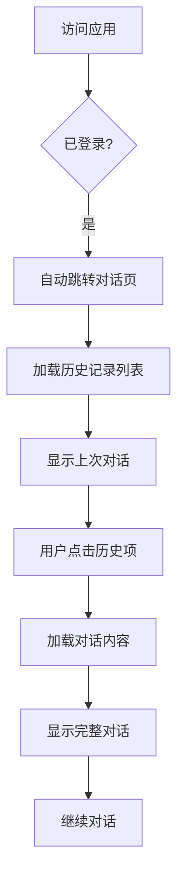
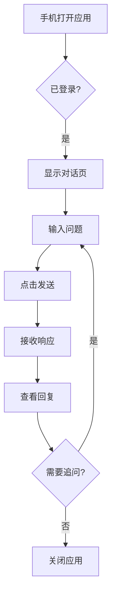

# 墨鱼AI智能助手 - 项目详细说明

> **版本**: v1.0.0
> **最后更新**: 2025-01
> **项目类型**: Web 前端应用（需配合后端 API）

---

## 目录

- [1. 项目概述](#1-项目概述)
- [2. 目标用户与使用场景](#2-目标用户与使用场景)
- [3. 核心功能列表](#3-核心功能列表)
- [4. 关键页面与流程](#4-关键页面与流程)
- [5. 技术架构](#5-技术架构)
- [6. 约束条件](#6-约束条件)
- [7. 特殊质量要求](#7-特殊质量要求)
- [8. 数据流与状态管理](#8-数据流与状态管理)
- [9. API 接口约定](#9-api-接口约定)

---

## 1. 项目概述

**墨鱼AI智能助手**是一个基于 **DeepSeek API** 的智能对话应用，提供流畅的 AI 对话体验。项目采用 **Vue 3 + Vite** 构建，使用 **Naive UI** 组件库和 **TailwindCSS** 实现美观的用户界面，支持深色/浅色主题切换，并针对移动端和桌面端进行了响应式优化。

### 核心价值

- 🚀 **流畅体验**: SSE 实时流式响应，支持可配置的打字效果
- 📱 **多端适配**: 完善的响应式设计，移动端和桌面端体验一致
- 🎨 **美观现代**: Naive UI + TailwindCSS，支持 Light/Dark 主题
- 💾 **历史管理**: 完整的对话历史记录和恢复功能
- 🔒 **安全可靠**: 完善的认证机制和 XSS 防护
- ⚡ **性能优化**: 虚拟滚动、代码分割、资源压缩

---

## 2. 目标用户与使用场景

### 2.1 目标用户

#### 主要用户群体

1. **个人用户** (60%)
   - 需要 AI 辅助的知识工作者
   - 学生、研究人员
   - 内容创作者、写作者
   - 程序员和开发者

2. **小团队** (30%)
   - 小型创业公司
   - 工作室、咨询团队
   - 需要私有化部署的团队

3. **技术爱好者** (10%)
   - AI 技术探索者
   - 开源贡献者
   - 技术博主

#### 用户特征

- **年龄**: 18-45 岁
- **技术水平**: 中等以上（会使用网页应用）
- **设备**: 主要使用桌面浏览器，偶尔使用移动设备
- **网络环境**: 稳定的互联网连接
- **使用频率**: 日均 3-10 次对话

### 2.2 核心使用场景

#### 场景 1: 日常知识问答（40%）

**典型用户**: 大学生 / 知识工作者
**使用时间**: 工作/学习时间
**使用地点**: 家中、办公室、图书馆
**使用设备**: 桌面浏览器（70%），移动端（30%）

**用户故事**:
> 小李是一名大学生，在写论文时遇到专业术语不理解，打开墨鱼AI，输入问题，AI 快速给出解释和相关知识。小李可以继续追问，AI 会基于上下文理解他的问题。对话历史会自动保存，方便后续查看。

**关键功能需求**:
- ✅ 快速响应（<2秒）
- ✅ 上下文理解（多轮对话）
- ✅ Markdown 格式化输出
- ✅ 历史记录保存和搜索

#### 场景 2: 代码编写与调试（30%）

**典型用户**: 程序员 / 开发者
**使用时间**: 开发时间
**使用地点**: 办公室、家中
**使用设备**: 桌面浏览器

**用户故事**:
> 张工是一名前端开发，在解决 Bug 时需要查询 Vue 3 的某个 API 用法。他向 AI 描述问题，AI 返回代码示例。代码会高亮显示，方便复制使用。他可以继续询问代码的优化方案。

**关键功能需求**:
- ✅ 代码语法高亮（支持多语言）
- ✅ 代码块一键复制
- ✅ 代码格式良好（缩进、换行）
- ✅ 支持长代码片段显示

#### 场景 3: 创意写作与内容生成（20%）

**典型用户**: 内容创作者 / 营销人员
**使用时间**: 创作时间
**使用地点**: 办公室、咖啡厅
**使用设备**: 桌面浏览器、平板

**用户故事**:
> 王小姐是一名新媒体编辑，需要为公司产品写推广文案。她向 AI 描述产品特点和目标受众，AI 生成多版本文案供选择。她可以要求 AI 调整语气或增加某些要点。

**关键功能需求**:
- ✅ 长文本生成（支持 2000+ 字）
- ✅ 打字效果（可配置速度，增加真实感）
- ✅ 支持停止生成（控制输出长度）
- ✅ 内容可编辑和导出

#### 场景 4: 移动端碎片化使用（10%）

**典型用户**: 通勤人群
**使用时间**: 通勤、等待时间
**使用地点**: 地铁、公交、户外
**使用设备**: 手机浏览器

**用户故事**:
> 李先生在地铁上通勤，打开手机浏览器访问墨鱼AI，快速提问获取信息。移动端界面简洁，操作流畅，历史记录抽屉可以快速切换话题。

**关键功能需求**:
- ✅ 移动端优化（触摸友好）
- ✅ 快速加载（FCP < 2s）
- ✅ 离线友好（历史记录可离线查看）
- ✅ 节省流量（代码分割、懒加载）

---

## 3. 核心功能列表

### 3.1 功能优先级矩阵

| 功能模块 | 优先级 | 状态 | 说明 |
|---------|-------|------|------|
| 用户认证 | P0 | ✅ 已完成 | 登录、注册、登出 |
| AI 对话 | P0 | ✅ 已完成 | 发送消息、接收 SSE 流式响应 |
| 历史记录 | P0 | ✅ 已完成 | 保存、加载、删除历史对话 |
| Markdown 渲染 | P0 | ✅ 已完成 | 支持标题、列表、代码、表格等 |
| 代码高亮 | P0 | ✅ 已完成 | 使用 highlight.js |
| 主题切换 | P1 | ✅ 已完成 | Light / Dark 模式 |
| 响应式设计 | P1 | ✅ 已完成 | 移动端 / 桌面端适配 |
| 打字效果 | P1 | ✅ 已完成 | 可配置速度（0-100ms/字符）|
| 停止生成 | P1 | ✅ 已完成 | 中途停止 AI 输出 |
| 个人设置 | P1 | ✅ 已完成 | 用户信息、密码、API Key |
| 推理过程显示 | P2 | ✅ 已完成 | 可折叠的思考过程 |
| 图片上传 | P3 | ❌ 已移除 | 暂不支持 |
| 多模态输入 | P3 | 🔄 计划中 | 语音输入、文件上传 |
| 对话导出 | P3 | 🔄 计划中 | 导出为 Markdown / PDF |
| 对话分享 | P3 | 🔄 计划中 | 生成分享链接 |

### 3.2 功能详细说明

#### 3.2.1 用户认证系统

**功能描述**:
- 用户注册（用户名 + 邮箱 + 密码）
- 用户登录（用户名 + 密码）
- 自动登录（基于 localStorage）
- 退出登录

**技术实现**:
- 使用 Pinia Store 管理用户状态
- localStorage 持久化用户信息（userId, username, apiKey）
- 路由守卫保护需要登录的页面
- 全局 401/403 拦截器自动跳转登录页

**安全机制**:
- API Key 加密存储
- HTTPS 传输（生产环境）
- CSRF Token 验证
- 密码最小长度 6 位

#### 3.2.2 AI 对话核心功能

**功能描述**:
- 实时流式对话（Server-Sent Events）
- 支持多轮对话（上下文理解）
- 支持 Reasoning（推理过程）显示
- 支持停止生成
- 消息格式化（Markdown + 代码高亮）

**技术实现**:
- 使用 EventSource API 接收 SSE 流
- 打字效果队列机制（可配置速度）
- DOMPurify 清理 HTML，防止 XSS
- marked + highlight.js 渲染 Markdown
- 自动滚动到最新消息

**交互细节**:
- 输入框自动聚焦
- Ctrl/Cmd + Enter 发送消息
- 发送时禁用输入框
- 加载中显示动画（三点跳动）
- 空状态提示（无对话时）

#### 3.2.3 历史记录管理

**功能描述**:
- 自动保存所有对话
- 侧边栏（桌面端）或抽屉（移动端）显示历史列表
- 点击历史项恢复对话
- 删除历史对话
- 历史项显示第一条消息作为标题

**技术实现**:
- 后端存储历史记录（按 taskId 组织）
- 前端分页加载（默认 20 条）
- 乐观更新（删除时立即更新 UI）
- 错误处理（删除失败时回滚）

**用户体验**:
- 桌面端: 左侧固定侧边栏，可关闭/打开
- 移动端: 抽屉式设计，从左侧滑出
- 活动项高亮显示
- 删除前二次确认

#### 3.2.4 Markdown 与代码渲染

**功能描述**:
- 支持 GitHub Flavored Markdown
- 代码语法高亮（支持 100+ 语言）
- 数学公式渲染（计划中）
- 表格、列表、引用格式化

**技术实现**:
```javascript
// 核心渲染逻辑
import { marked } from 'marked';
import hljs from 'highlight.js';
import DOMPurify from 'dompurify';

marked.setOptions({
  highlight: (code, lang) => {
    if (lang && hljs.getLanguage(lang)) {
      return hljs.highlight(code, { language: lang }).value;
    }
    return hljs.highlightAuto(code).value;
  },
  breaks: true,
  gfm: true
});

const safeMarkdown = (text) => {
  const rawHtml = marked(text);
  return DOMPurify.sanitize(rawHtml);
};
```

**支持的 Markdown 特性**:
- ✅ 标题（H1-H6）
- ✅ 粗体、斜体、删除线
- ✅ 无序列表、有序列表
- ✅ 代码块、行内代码
- ✅ 链接、图片
- ✅ 引用块
- ✅ 表格
- ✅ 分隔线
- ❌ 数学公式（LaTex）- 计划中

#### 3.2.5 主题系统

**功能描述**:
- 支持 Light / Dark 双主题
- 支持跟随系统（计划中）
- 全局主题切换
- 主题持久化

**技术实现**:
- 使用 Pinia Store 管理主题状态
- Naive UI NConfigProvider 全局配置
- CSS 变量适配（`var(--n-text-color)`）
- TailwindCSS dark: 前缀适配
- localStorage 持久化主题选择

**主题切换性能**:
- 切换动画: 300ms
- 无闪烁（prefers-color-scheme）
- 自动同步所有组件

#### 3.2.6 响应式设计

**功能描述**:
- 移动端（< 768px）优化
- 平板（768px - 1024px）适配
- 桌面端（> 1024px）布局

**设计差异**:

| 特性 | 桌面端 | 移动端 |
|-----|-------|--------|
| 历史记录 | 左侧固定侧边栏 | 抽屉式（从左滑出）|
| 消息宽度 | 最大 85% | 最大 90% |
| 输入框 | 多行，自动扩展 | 单行，点击展开 |
| 按钮大小 | 40px × 40px | 44px × 44px |
| 字体大小 | 16px | 14px |
| 间距 | 20px | 12px |

**触摸优化**（移动端）:
- 按钮最小触摸区域: 44px × 44px
- 支持手势操作（抽屉滑动）
- 禁用长按文本选择（按钮区域）
- 虚拟键盘适配

#### 3.2.7 打字效果

**功能描述**:
- 模拟真实打字效果
- 可配置速度（0 = 即时显示，100 = 最慢）
- 支持停止后立即显示剩余内容

**技术实现**:
```javascript
// 打字队列机制
const typingQueue = [];
const processNext = () => {
  if (typingQueue.length === 0) return;

  const { type, text } = typingQueue.shift();
  appendToMessage(type, text); // 添加单个字符

  if (typingQueue.length > 0) {
    setTimeout(processNext, typingSpeed.value);
  }
};

// SSE 接收到数据时
const appendContent = (text) => {
  for (const char of text) {
    typingQueue.push({ type: 'content', text: char });
  }
  processTypingQueue();
};
```

**用户体验**:
- 默认速度: 30ms/字符（舒适阅读）
- 设置页面可调整: 0-100ms
- 实时预览速度效果
- 停止生成时清空队列

#### 3.2.8 个人设置

**功能描述**:
- 个人资料（用户名、邮箱）
- 安全设置（修改密码、重置 API Key）
- 外观设置（主题、语言、打字速度）

**技术实现**:
- 三个 Tab 页组织
- 表单验证（邮箱格式、密码强度）
- 修改密码后强制重新登录
- API Key 脱敏显示（password input）

---

## 4. 关键页面与流程

### 4.1 页面结构

```
/
├── /login               登录/注册页
├── /chat                主对话页
├── /settings            个人设置页
├── /about               关于页面
└── /404                 404 页面
```

### 4.2 页面详细说明

#### 4.2.1 登录/注册页 (`/login`)

**页面结构**:
```
┌─────────────────────────────────┐
│         墨鱼AI                   │
│    智能助手，随时为您服务         │
├─────────────────────────────────┤
│  [登录] [注册]                   │
│                                 │
│  用户名: [_____________]         │
│  密码:   [_____________]         │
│                                 │
│  [      登录按钮      ]          │
│                                 │
│  没有账号？立即注册   忘记密码？   │
└─────────────────────────────────┘
```

**交互流程**:
1. 用户访问 `/login`
2. 如果已登录 → 自动跳转 `/chat`
3. 未登录 → 显示登录表单
4. 用户输入凭证 → 点击登录
5. 验证成功 → 保存用户信息 → 跳转 `/chat`
6. 验证失败 → 显示错误提示

**验证规则**:
- 用户名: 必填
- 密码: 必填，最小 6 位
- 邮箱: 必填（注册时），格式验证

**错误处理**:
- 用户名或密码错误 → "用户名或密码错误"
- 用户名已存在 → "用户名已被注册"
- 网络错误 → "网络连接失败，请稍后重试"

#### 4.2.2 主对话页 (`/chat`)

**页面结构** (桌面端):
```
┌─────────────────────────────────────────────┐
│ [≡] 墨鱼AI助手    [🔆] [⚙] [↗]              │ ← Header
├──────┬──────────────────────────────────────┤
│      │                                      │
│ 历史 │            对话区域                   │
│ 记录 │                                      │
│ 侧边 │  User: 你好                          │
│ 栏   │  AI:   你好！有什么可以帮助你的？      │
│      │                                      │
│ [+]  │                                      │
│ 对话1│                                      │
│ 对话2│                                      │
│      │                                      │
├──────┴──────────────────────────────────────┤
│ [📎] 输入消息...              [🛑] [发送]    │ ← Input
└─────────────────────────────────────────────┘
```

**页面结构** (移动端):
```
┌─────────────────────────────┐
│ [≡] 墨鱼AI  [🔆] [⚙] [↗]    │ ← Header
├─────────────────────────────┤
│                             │
│        对话区域              │
│                             │
│  User: 你好                 │
│  AI:   你好！               │
│                             │
├─────────────────────────────┤
│ 输入消息...       [发送]     │ ← Input
└─────────────────────────────┘
```

**交互流程**:
1. 用户输入消息
2. 点击发送（或 Ctrl+Enter）
3. 消息立即显示在对话区
4. 显示 AI 加载动画
5. 接收 SSE 流式响应
6. 逐字显示 AI 回复（打字效果）
7. 回复完成，启用输入框

**特殊交互**:
- **停止生成**: 点击停止按钮 → 调用 `/stop` API → 清空打字队列 → 显示已接收内容
- **清空对话**: 点击清空按钮 → 二次确认 → 清空当前对话（不删除历史记录）
- **切换历史**: 点击历史项 → 加载对话内容 → 替换当前对话
- **删除历史**: 点击删除按钮 → 二次确认 → 调用删除 API → 更新列表

**空状态设计**:
```
┌─────────────────────────────┐
│                             │
│          💬                 │
│      开始对话                │
│ 向我提问任何问题，我会尽力帮助你 │
│                             │
└─────────────────────────────┘
```

#### 4.2.3 个人设置页 (`/settings`)

**页面结构**:
```
┌─────────────────────────────────┐
│ ← 个人设置                       │
├─────────────────────────────────┤
│ [个人资料] [安全设置] [外观设置] │
├─────────────────────────────────┤
│                                 │
│  用户名: [_____________]         │
│  邮箱:   [_____________]         │
│                                 │
│  [保存修改]                      │
│                                 │
└─────────────────────────────────┘
```

**个人资料 Tab**:
- 用户名（可修改）
- 邮箱（可修改）
- 保存按钮

**安全设置 Tab**:
- 修改密码
  - 当前密码（必填）
  - 新密码（必填，最小 6 位）
  - 确认新密码（必须一致）
  - 更新按钮 → 成功后强制重新登录
- API 密钥
  - 显示当前密钥（脱敏）
  - 重置按钮 → 二次确认 → 生成新密钥

**外观设置 Tab**:
- 主题选择
  - 浅色
  - 深色
  - 跟随系统（计划中）
- 语言选择
  - 简体中文
  - English（计划中）
- 打字速度
  - 滑动条（0-100）
  - 实时预览描述
  - 即时显示 / 快速 / 中速 / 慢速

### 4.3 核心用户流程

#### 流程 1: 新用户注册并首次对话



**时间线**:
- T0: 访问应用
- T1 (0-1s): 检查登录状态，显示登录页
- T2 (10-30s): 用户填写注册信息
- T3 (1-2s): 提交注册，验证信息
- T4 (0.5s): 保存用户信息，跳转对话页
- T5 (0-5s): 用户输入第一条消息
- T6 (0.5s): 发送消息，显示加载状态
- T7 (1-3s): 接收AI响应，开始打字效果
- T8 (5-30s): 完整响应接收完成

**性能要求**:
- 注册/登录响应时间: < 2s
- 页面跳转时间: < 500ms
- 首次消息响应: < 3s

#### 流程 2: 老用户继续历史对话



**时间线**:
- T0: 访问应用
- T1 (0.5s): 检查登录状态（localStorage）
- T2 (0.3s): 跳转对话页
- T3 (0.5-1s): 加载历史记录列表（20条）
- T4 (0.3s): 显示上次对话内容（从缓存）
- T5: 用户浏览或点击历史
- T6 (0.5-1s): 加载选中的对话内容
- T7: 继续对话

**性能要求**:
- 自动登录检查: < 100ms
- 历史列表加载: < 1s
- 对话内容加载: < 1s
- 页面可交互时间: < 2s

#### 流程 3: 移动端快速提问



**特殊优化**:
- 首屏加载: < 2s（4G网络）
- 输入框自动聚焦（移动端不自动弹出键盘）
- 触摸区域优化（≥ 44px × 44px）
- 支持语音输入（计划中）

---

## 5. 技术架构

### 5.1 技术栈总览

| 层级 | 技术 | 版本 | 用途 |
|-----|------|-----|------|
| **框架** | Vue | 3.5.13 | 响应式框架 |
| **构建** | Vite | 6.1.0 | 开发服务器 + 打包工具 |
| **状态** | Pinia | 3.0.1 | 状态管理 |
| **路由** | Vue Router | 4.5.0 | 前端路由 |
| **UI库** | Naive UI | 2.41.0 | 组件库 |
| **样式** | TailwindCSS | 3.4.17 | 工具类CSS |
| **HTTP** | Axios | 1.8.1 | HTTP客户端 |
| **Markdown** | marked | 15.0.7 | Markdown解析 |
| **代码高亮** | highlight.js | 11.11.1 | 语法高亮 |
| **XSS防护** | DOMPurify | 3.3.0 | HTML清理 |
| **虚拟滚动** | Virtua | 0.46.7 | 长列表优化 |

### 5.2 项目目录结构

```
moyuDeepSeekAI/
├── public/                # 静态资源
│   └── favicon.ico
├── src/
│   ├── assets/           # 资源文件
│   │   ├── images/
│   │   └── styles/
│   ├── components/       # 组件
│   │   ├── chat/         # 聊天相关组件
│   │   │   ├── ChatHeader.vue
│   │   │   ├── ChatInput.vue
│   │   │   ├── HistorySidebar.vue
│   │   │   └── VirtualMessageList.vue
│   │   └── icons/        # 图标组件
│   ├── constants/        # 常量
│   │   └── errorCodes.js
│   ├── router/           # 路由配置
│   │   └── index.js
│   ├── stores/           # Pinia Stores
│   │   ├── index.js
│   │   ├── user.js       # 用户状态
│   │   ├── theme.js      # 主题状态
│   │   └── chat.js       # 聊天状态
│   ├── utils/            # 工具函数
│   │   ├── request.js    # API封装
│   │   └── markdown.js   # Markdown渲染
│   ├── views/            # 页面组件
│   │   ├── LoginView.vue
│   │   ├── HomeView.vue  # 主对话页
│   │   ├── SettingsView.vue
│   │   ├── AboutView.vue
│   │   └── NotFoundView.vue
│   ├── App.vue           # 根组件
│   └── main.js           # 入口文件
├── .gitignore
├── CLAUDE.md             # 项目开发指南
├── CONSTITUTION.md       # 项目宪法
├── PROJECT_SPECIFICATION.md # 本文档
├── eslint.config.js      # ESLint配置
├── index.html
├── package.json
├── postcss.config.js
├── tailwind.config.js
└── vite.config.js
```

### 5.3 核心架构设计

#### 5.3.1 组件化架构

```
App.vue
├── Router View
    ├── LoginView.vue
    ├── HomeView.vue
    │   ├── ChatHeader.vue
    │   ├── HistorySidebar.vue (桌面端)
    │   │   └── HistoryItem (v-for)
    │   ├── MessageList
    │   │   └── MessageItem (v-for)
    │   │       ├── UserMessage
    │   │       └── AssistantMessage
    │   │           ├── ReasoningSection (可折叠)
    │   │           └── AnswerContent
    │   └── ChatInput.vue
    ├── SettingsView.vue
    │   └── NTabs
    │       ├── ProfileTab
    │       ├── SecurityTab
    │       └── AppearanceTab
    └── NotFoundView.vue
```

#### 5.3.2 状态管理架构

**User Store** (`stores/user.js`):
```javascript
{
  state: {
    userId: string | null,
    username: string | null,
    apiKey: string | null,
    isLoggedIn: boolean
  },
  actions: {
    login(userData),
    logout(),
    updateUserInfo(updates)
  }
}
```

**Theme Store** (`stores/theme.js`):
```javascript
{
  state: {
    themeMode: 'light' | 'dark' | 'system'
  },
  computed: {
    currentTheme: NaiveTheme | null,
    isDark: boolean
  },
  actions: {
    setThemeMode(mode),
    toggleTheme()
  }
}
```

**Chat Store** (`stores/chat.js`):
```javascript
{
  state: {
    currentTaskId: string | null,
    conversationHistory: Message[],
    isGenerating: boolean,
    historyTasks: HistoryTask[]
  },
  actions: {
    setCurrentTask(taskId),
    addMessage(message),
    clearConversation(),
    loadHistory()
  }
}
```

#### 5.3.3 路由架构

```javascript
// router/index.js
const routes = [
  {
    path: '/login',
    name: 'login',
    component: LoginView,
    meta: { requiresAuth: false }
  },
  {
    path: '/chat',
    name: 'chat',
    component: HomeView,
    meta: { requiresAuth: true }
  },
  {
    path: '/settings',
    name: 'settings',
    component: SettingsView,
    meta: { requiresAuth: true }
  },
  {
    path: '/',
    redirect: '/chat'
  },
  {
    path: '/:pathMatch(.*)*',
    name: 'notFound',
    component: NotFoundView
  }
];

// 路由守卫
router.beforeEach((to, from, next) => {
  const userStore = useUserStore();

  if (to.meta.requiresAuth && !userStore.isLoggedIn) {
    next('/login');
  } else if (to.path === '/login' && userStore.isLoggedIn) {
    next('/chat');
  } else {
    next();
  }
});
```

---

## 6. 约束条件

### 6.1 技术约束

#### 6.1.1 前后端分离

**约束**:
- 本项目为**纯前端应用**
- 依赖后端 API 服务（需单独部署）
- 前端与后端通过 RESTful API + SSE 通信

**影响**:
- 前端无法独立运行（需配置后端 API 地址）
- 需要处理 CORS 跨域问题
- 后端 API 需要支持 SSE（Server-Sent Events）

**解决方案**:
- 开发环境: Vite Proxy 代理（`vite.config.js`）
  ```javascript
  server: {
    proxy: {
      '/api': {
        target: 'http://localhost:8999',
        changeOrigin: true
      }
    }
  }
  ```
- 生产环境: Nginx 反向代理或配置 CORS

#### 6.1.2 浏览器兼容性

**最低支持**:
- Chrome: ≥ 90
- Firefox: ≥ 88
- Safari: ≥ 14
- Edge: ≥ 90

**不支持**:
- IE 11 及以下
- 旧版移动浏览器（iOS < 14, Android < 9）

**原因**:
- 使用 ES6+ 语法（不做降级编译）
- 使用 CSS Grid / Flexbox
- 使用 EventSource API（SSE）
- 使用 localStorage / sessionStorage

#### 6.1.3 网络环境

**要求**:
- 稳定的互联网连接
- 支持 HTTPS（生产环境）
- 支持 WebSocket / SSE 长连接

**限制**:
- 不支持完全离线使用
- 历史记录可离线查看（已加载的内容）
- 网络不稳定时可能出现 SSE 断开

#### 6.1.4 设备要求

**最低配置**:
- RAM: ≥ 2GB
- 屏幕分辨率: ≥ 375px × 667px（iPhone SE）
- CPU: 现代双核处理器

**推荐配置**:
- RAM: ≥ 4GB
- 屏幕分辨率: ≥ 1920px × 1080px（桌面端）
- CPU: 四核及以上

### 6.2 业务约束

#### 6.2.1 用户认证

**约束**:
- 所有对话功能需要登录
- API Key 由后端生成和管理
- 不支持第三方登录（OAuth）
- 不支持找回密码（当前版本）

#### 6.2.2 数据存储

**约束**:
- 用户数据存储在后端数据库
- 前端仅缓存必要信息（localStorage）
- 历史记录无数量限制（后端控制）
- 单条消息最大长度: 10,000 字符

#### 6.2.3 API 限制

**约束**:
- 依赖 DeepSeek API（或兼容的 API）
- API 调用频率由后端控制
- 并发请求限制（同一用户）
- 响应超时: 180 秒

### 6.3 部署约束

#### 6.3.1 前端部署

**支持**:
- ✅ 静态托管（Nginx, Apache）
- ✅ CDN 部署（Cloudflare, AWS CloudFront）
- ✅ 容器化部署（Docker）
- ✅ Serverless 部署（Vercel, Netlify）

**不支持**:
- ❌ SSR 服务端渲染（当前架构不支持）
- ❌ ISR 增量静态生成

#### 6.3.2 环境要求

**开发环境**:
- Node.js: ≥ 18
- npm: ≥ 9 或 pnpm ≥ 8

**生产环境**:
- HTTPS 必须（安全要求）
- CDN 推荐（性能优化）
- Gzip / Brotli 压缩（必须）

---

## 7. 特殊质量要求

### 7.1 代码质量要求（遵循 CONSTITUTION.md）

#### 7.1.1 代码风格

**强制执行**:
- ✅ ESLint 检查（`npm run lint`）
- ✅ Prettier 格式化（`npm run format`）
- ✅ 提交前自动检查（Git Hooks）

**核心规则**:
```javascript
// 函数复杂度
'complexity': ['error', 10],
'max-depth': ['error', 3],
'max-lines-per-function': ['error', { max: 50 }],
'max-params': ['error', 4],

// Vue 规范
'vue/max-attributes-per-line': ['error', { singleline: 3 }],
'vue/component-name-in-template-casing': ['error', 'PascalCase'],
```

**命名规范**:
- 组件: `PascalCase` (ChatHeader.vue)
- 函数/变量: `camelCase` (handleSubmit)
- 常量: `UPPER_SNAKE_CASE` (MAX_RETRIES)
- CSS类: `kebab-case` (chat-header)

#### 7.1.2 组件设计原则

**单一职责**:
- 每个组件只做一件事
- 单个组件 ≤ 500 行代码
- 复杂组件必须拆分

**可复用性**:
- 通用组件放入 `components/`
- Props 和 Events 明确定义
- 提供默认值和类型检查

**示例**:
```vue
<!-- ✅ 正确 - Props 明确定义 -->
<script setup>
defineProps({
  title: {
    type: String,
    required: true
  },
  isActive: {
    type: Boolean,
    default: false
  }
});
</script>
```

### 7.2 测试标准要求

#### 7.2.1 单元测试（计划中）

**最低覆盖率**:
- 行覆盖率: ≥ 70%
- 分支覆盖率: ≥ 65%
- 函数覆盖率: ≥ 75%

**必须测试**:
- ✅ 工具函数（`utils/`）
- ✅ Store 状态管理（`stores/`）
- ✅ API 请求封装（`request.js`）
- ✅ Markdown 渲染（`markdown.js`）

#### 7.2.2 集成测试（计划中）

**测试范围**:
- ✅ API 端点集成
- ✅ SSE 流式响应
- ✅ 路由守卫
- ✅ 用户认证流程

#### 7.2.3 E2E 测试（计划中）

**核心用户流程**:
- ✅ 注册 → 登录 → 首次对话
- ✅ 登录 → 查看历史 → 恢复对话
- ✅ 修改设置 → 主题切换
- ✅ 移动端: 打开应用 → 快速提问

**跨浏览器测试**:
- Chrome (最新版)
- Firefox (最新版)
- Safari (最新版)
- Edge (最新版)

### 7.3 用户体验一致性要求

#### 7.3.1 交互响应时间

**强制指标**:

| 操作类型 | 响应时间 | 衡量标准 |
|---------|---------|---------|
| 按钮点击 | < 100ms | 视觉反馈出现 |
| 输入响应 | < 50ms | 字符显示 |
| 页面切换 | < 300ms | 新页面渲染 |
| API 响应 | < 2000ms | 开始接收数据 |
| 消息发送 | < 1000ms | 消息显示确认 |

**测试方法**:
- Chrome DevTools Performance
- Lighthouse
- Real User Monitoring (RUM)

#### 7.3.2 视觉一致性

**Naive UI 组件**:
- ✅ 统一使用 Naive UI 组件
- ✅ 不自定义实现已有组件
- ✅ 主题配置全局统一

**TailwindCSS 样式**:
- ✅ 优先使用 Tailwind 工具类
- ✅ 避免不必要的自定义 CSS
- ✅ 颜色、间距使用设计系统

**主题适配**:
```vue
<!-- ✅ 正确 - 使用 Tailwind dark 模式 -->
<div class="bg-white dark:bg-gray-900">
  <p class="text-gray-900 dark:text-white">内容</p>
</div>

<!-- ❌ 错误 - 不使用内联样式 -->
<div :style="{ background: isDark ? '#000' : '#fff' }">
  内容
</div>
```

#### 7.3.3 无障碍性（Accessibility）

**WCAG 2.1 AA 级别**:

**键盘导航**:
- ✅ 所有交互元素支持 Tab 导航
- ✅ 焦点指示器明显（outline: 2px）
- ✅ 快捷键支持（Ctrl+Enter 发送）

**语义化 HTML**:
```vue
<!-- ✅ 正确 -->
<nav aria-label="主导航">
  <button aria-label="关闭侧边栏">
    <n-icon><CloseIcon /></n-icon>
  </button>
</nav>

<!-- ❌ 错误 -->
<div class="nav">
  <div @click="close">
    <n-icon><CloseIcon /></n-icon>
  </div>
</div>
```

**色彩对比度**:
- 正文: 对比度 ≥ 4.5:1
- 大号文字: 对比度 ≥ 3:1
- UI 组件: 对比度 ≥ 3:1

#### 7.3.4 多终端一致性

**响应式断点**:
- `sm`: ≥ 640px
- `md`: ≥ 768px
- `lg`: ≥ 1024px
- `xl`: ≥ 1280px

**移动端优化**:
- 触摸目标: ≥ 44px × 44px
- 字体大小: ≥ 14px
- 行高: ≥ 1.5
- 支持手势操作（抽屉滑动）

**测试清单**:
- [ ] iPhone SE (375px × 667px)
- [ ] iPad (768px × 1024px)
- [ ] 桌面 (1920px × 1080px)
- [ ] 横屏模式
- [ ] 不出现横向滚动条

### 7.4 性能要求

#### 7.4.1 首屏加载性能

**Core Web Vitals 指标**:

| 指标 | 优秀 | 良好 | 需优化 |
|-----|------|------|--------|
| **FCP** (首次内容绘制) | < 1.0s | 1.0s - 2.5s | > 2.5s |
| **LCP** (最大内容绘制) | < 2.0s | 2.0s - 4.0s | > 4.0s |
| **FID** (首次输入延迟) | < 100ms | 100ms - 300ms | > 300ms |
| **CLS** (累积布局偏移) | < 0.1 | 0.1 - 0.25 | > 0.25 |
| **TTI** (可交互时间) | < 3.0s | 3.0s - 5.0s | > 5.0s |

**资源大小限制**:
- Vendor Bundle (gzipped): < 200 KB
- 单个路由 Bundle (gzipped): < 100 KB
- 首屏 JS 总大小 (gzipped): < 300 KB
- 首屏 CSS (gzipped): < 50 KB
- 首屏图片: < 500 KB

**优化措施**:
```javascript
// 路由懒加载
const HomeView = () => import('@/views/HomeView.vue');

// 组件懒加载
const HeavyComponent = defineAsyncComponent(() =>
  import('@/components/HeavyComponent.vue')
);

// Vite 打包优化
export default {
  build: {
    rollupOptions: {
      output: {
        manualChunks: {
          'vue-vendor': ['vue', 'vue-router', 'pinia'],
          'ui-vendor': ['naive-ui'],
        }
      }
    }
  }
};
```

#### 7.4.2 运行时性能

**内存占用**:
- 首屏加载后: < 50 MB
- 正常使用 30 分钟: < 150 MB
- 内存增长率: < 2 MB/分钟

**长列表优化**:
- 使用虚拟滚动（Virtua）
- 单页最多显示: 100 条消息
- 超过时: 分页或虚拟滚动

**动画性能**:
- 帧率: ≥ 60 FPS
- 使用 CSS Transform / Opacity（GPU 加速）
- 避免触发重排（width, height, left）

```css
/* ✅ 正确 - 使用 transform */
.element {
  transform: translateX(100px);
  transition: transform 0.3s;
}

/* ❌ 错误 - 触发重排 */
.element {
  left: 100px;
  transition: left 0.3s;
}
```

#### 7.4.3 网络性能

**请求优化**:
- 首屏请求数: < 20 个
- 同时并发请求: < 6 个 (HTTP/1.1)
- API 响应缓存（合理使用）

**数据传输**:
- 启用 Gzip / Brotli 压缩
- 使用 CDN（静态资源）
- 图片使用 WebP 格式
- API 响应 JSON 压缩

**SSE 流式传输**:
- 连接超时: 180 秒
- 心跳包: 30 秒
- 自动重连机制

---

## 8. 数据流与状态管理

### 8.1 数据流设计

#### 8.1.1 用户认证流

```
┌─────────────┐
│   用户登录   │
└──────┬──────┘
       │
       v
┌─────────────────┐
│ POST /api/login │
└──────┬──────────┘
       │ 返回: userId, username, apiKey
       v
┌──────────────────┐
│  Pinia userStore │
│  - login(data)   │
└──────┬───────────┘
       │
       v
┌──────────────────┐
│   localStorage   │
│  - userId        │
│  - username      │
│  - apiKey        │
└──────────────────┘
```

#### 8.1.2 对话消息流

```
┌─────────────┐
│ 用户输入消息 │
└──────┬──────┘
       │
       v
┌──────────────────┐
│ conversationHistory.push(userMsg) │
└──────┬───────────┘
       │
       v
┌──────────────────┐
│ POST /api/start  │ (首次) 或
│ POST /api/continue│ (续对话)
└──────┬───────────┘
       │ 返回: taskId
       v
┌──────────────────┐
│ EventSource      │
│ /api/events      │
└──────┬───────────┘
       │ SSE 流式数据
       v
┌──────────────────┐
│ 打字效果队列      │
│ typingQueue      │
└──────┬───────────┘
       │
       v
┌──────────────────┐
│ 逐字显示在界面    │
│ (30ms/字符)      │
└──────────────────┘
```

#### 8.1.3 历史记录流

```
┌──────────────────┐
│ 加载历史记录列表  │
└──────┬───────────┘
       │
       v
┌──────────────────┐
│ GET /api/history │
└──────┬───────────┘
       │ 返回: tasks[]
       v
┌──────────────────┐
│ historyTasks.value = formatTasks(data) │
└──────┬───────────┘
       │
       v
┌──────────────────┐
│ 渲染侧边栏列表    │
└──────────────────┘
       │ 用户点击历史项
       v
┌──────────────────┐
│ GET /api/history/:taskId │
└──────┬───────────┘
       │ 返回: messages[]
       v
┌──────────────────┐
│ conversationHistory = messages │
│ currentTaskId = taskId │
└──────────────────┘
```

### 8.2 LocalStorage 使用规范

**存储内容**:
```javascript
{
  // 用户认证
  "userId": "123456",
  "username": "张三",
  "apiKey": "sk-xxxxxxxxx",

  // 主题设置
  "themeMode": "dark",

  // 用户偏好
  "typingSpeed": "30",

  // 缓存（可选）
  "lastConversationId": "conv_123"
}
```

**注意事项**:
- ❌ 不存储敏感信息（密码、完整 API Key）
- ✅ API Key 仅用于请求头，不暴露在代码中
- ✅ 定期清理过期数据
- ✅ 总大小 < 5 MB

---

## 9. API 接口约定

### 9.1 后端 API 要求

#### 9.1.1 基础信息

**Base URL**: `http://localhost:8999/api` (开发环境)
**协议**: RESTful API + SSE
**认证**: API Key (Header: `X-API-Key`)
**格式**: JSON

#### 9.1.2 核心接口列表

##### 1. 用户认证

**POST /api/register**
```json
// Request
{
  "username": "zhangsan",
  "email": "zhang@example.com",
  "password": "password123"
}

// Response
{
  "id": "123456",
  "username": "zhangsan",
  "api_key": "sk-xxxxxxxxxxxx"
}
```

**POST /api/login**
```json
// Request
{
  "username": "zhangsan",
  "password": "password123"
}

// Response
{
  "id": "123456",
  "username": "zhangsan",
  "api_key": "sk-xxxxxxxxxxxx"
}
```

##### 2. 对话接口

**POST /api/start**
```json
// Request
{
  "content": "你好，请介绍一下自己",
  "userId": "123456"
}

// Response
{
  "taskId": "task_abc123"
}
```

**POST /api/continue**
```json
// Request
{
  "taskId": "task_abc123",
  "content": "那你能做什么？"
}

// Response
{
  "success": true
}
```

**POST /api/stop/:taskId**
```json
// Request
// 无 body

// Response
{
  "success": true
}
```

##### 3. SSE 流式响应

**GET /api/events?taskId=xxx&userId=xxx**

**Event Types**:
```javascript
// 推理过程
event: reasoning
data: {"reasoning": "正在思考..."}

// 回复内容
event: content
data: {"content": "你好！"}

// 完成
event: done
data: {"status": "completed"}

// 错误
event: error
data: {"error": "服务器错误"}
```

##### 4. 历史记录

**GET /api/history?userId=xxx**
```json
// Response
{
  "tasks": [
    {
      "taskId": "task_123",
      "firstMessage": "你好",
      "startTime": "2025-01-01T10:00:00Z"
    }
  ]
}
```

**GET /api/history/:taskId?userId=xxx**
```json
// Response
{
  "messages": [
    {
      "role": "user",
      "content": "你好"
    },
    {
      "role": "assistant",
      "reasoning": "用户打招呼",
      "content": "你好！很高兴见到你。"
    }
  ]
}
```

**DELETE /api/history/:taskId?userId=xxx**
```json
// Response
{
  "success": true
}
```

##### 5. 用户设置

**GET /api/user/:userId**
```json
// Response
{
  "username": "zhangsan",
  "email": "zhang@example.com"
}
```

**PUT /api/user/:userId**
```json
// Request
{
  "username": "zhangsan",
  "email": "newmail@example.com"
}

// Response
{
  "success": true
}
```

**GET /api/settings?userId=xxx**
```json
// Response
{
  "settings": {
    "theme": "dark",
    "language": "zh-CN",
    "typingSpeed": "30"
  }
}
```

**POST /api/settings/theme**
```json
// Request
{
  "userId": "123456",
  "value": "dark"
}

// Response
{
  "success": true
}
```

### 9.2 错误处理

#### 9.2.1 HTTP 状态码

| 状态码 | 说明 | 处理方式 |
|-------|------|---------|
| 200 | 成功 | 正常处理 |
| 400 | 请求参数错误 | 显示错误提示 |
| 401 | 未认证 | 清除登录信息，跳转登录页 |
| 403 | 无权限 | 显示权限提示 |
| 404 | 资源不存在 | 显示友好提示 |
| 500 | 服务器错误 | 显示错误提示，建议重试 |

#### 9.2.2 错误响应格式

```json
{
  "code": "USER_NOT_FOUND",
  "message": "用户不存在"
}
```

**前端错误码映射**:
```javascript
// constants/errorCodes.js
export const ERROR_CODES = {
  'USER_NOT_FOUND': '用户不存在',
  'INVALID_PASSWORD': '密码错误',
  'USERNAME_EXISTS': '用户名已被注册',
  'NETWORK_ERROR': '网络连接失败，请稍后重试'
};
```

---

## 10. 版本历史与路线图

### 10.1 当前版本 (v1.0.0)

**发布日期**: 2025-01
**状态**: ✅ 稳定版

**核心功能**:
- ✅ 用户认证（注册、登录）
- ✅ AI 对话（SSE 流式响应）
- ✅ 历史记录管理
- ✅ Markdown 渲染 + 代码高亮
- ✅ 主题切换（Light / Dark）
- ✅ 响应式设计（移动端 + 桌面端）
- ✅ 打字效果（可配置速度）
- ✅ 个人设置

### 10.2 计划功能 (v1.1 - v2.0)

#### v1.1 (计划中)

- 🔄 对话导出（Markdown / PDF）
- 🔄 对话分享（生成分享链接）
- 🔄 语音输入（Web Speech API）
- 🔄 多语言支持（英文）
- 🔄 找回密码功能
- 🔄 数学公式渲染（KaTeX）

#### v1.2 (计划中)

- 🔄 多模态输入（图片上传）
- 🔄 对话标签和分类
- 🔄 搜索历史记录
- 🔄 用户头像自定义
- 🔄 键盘快捷键自定义

#### v2.0 (远期规划)

- 🔮 团队协作功能
- 🔮 知识库集成
- 🔮 插件系统
- 🔮 移动端 App（React Native）
- 🔮 桌面端 App（Electron）

---

## 11. 总结

### 11.1 项目定位

**墨鱼AI智能助手**是一个**现代化、高性能、易用的 AI 对话应用**，专注于提供流畅的对话体验和完善的用户体验。

### 11.2 核心优势

1. **技术先进**: Vue 3 + Vite + Pinia + Naive UI，使用最新技术栈
2. **性能优越**: FCP < 1s, LCP < 2s，符合 Core Web Vitals 标准
3. **体验优秀**: 流式响应、打字效果、深色模式、响应式设计
4. **代码规范**: 遵循宪法级标准，ESLint + Prettier 强制执行
5. **易于维护**: 组件化架构、清晰的状态管理、完善的文档

### 11.3 适用场景

✅ **适合**:
- 需要 AI 辅助的个人用户
- 小型团队的内部工具
- 学习和研究 Vue 3 + AI 应用开发

❌ **不适合**:
- 大规模企业级应用（需要更复杂的权限系统）
- 离线使用场景
- 需要 SSR 的 SEO 敏感场景

---

**文档维护者**: Claude Code
**最后更新**: 2025-01
**反馈联系**: 请提交 Issue 到项目仓库
